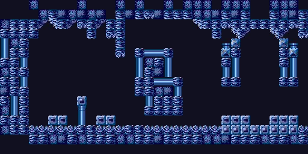

# gba-toolchain Template

This template builds a version of the Tonc Brinstar demo.



## Cloning

A submodule for [gba-toolchain](https://github.com/felixjones/gba-toolchain) is provided, however an existing install of `gba-toolchain` can be used by modifying the `toolchainFile` field of `CMakePresets.json`.

```sh
git clone --recurse-submodules https://github.com/felixjones/gba-toolchain-template.git
```

# Requirements

* [CMake](https://cmake.org/) (3.18 minimum)
* Arm compiler toolchain ([Arm GNU Toolchain](https://developer.arm.com/downloads/-/arm-gnu-toolchain-downloads), [devkitPro](https://devkitpro.org/))

## Additional

A host compiler is required if `grit` is not detected.

`FreeImage` will be compiled during the configure process if both `grit` is not detected and `FreeImage`.

# Build with CMake

## Command line

Configure `release` preset into `cmake-build-release` (see `CMakePresets.json`)
```sh
cmake -S . --preset=release
```
Build `brin_demo.elf` into `cmake-build-release`
```sh
cmake --build cmake-build-release
```
Install `brin_demo.gba` into `bin/release`
```sh
cmake --install cmake-build-release
```
